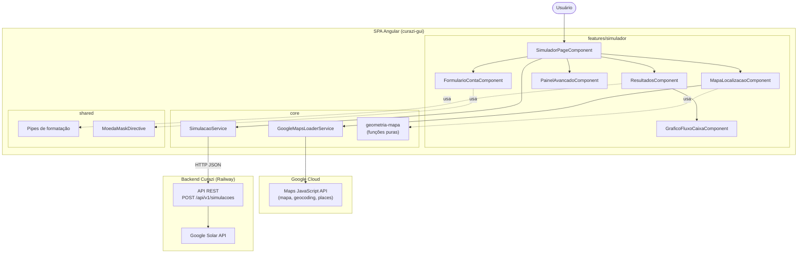
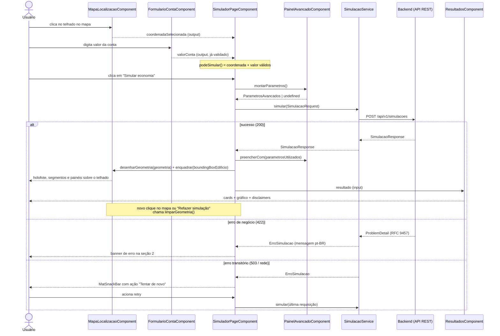
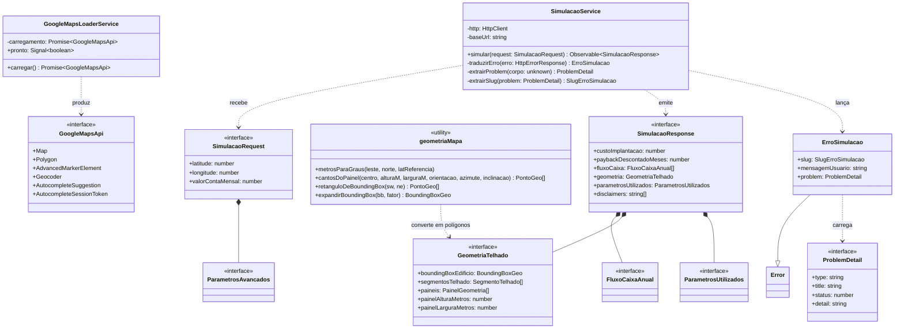
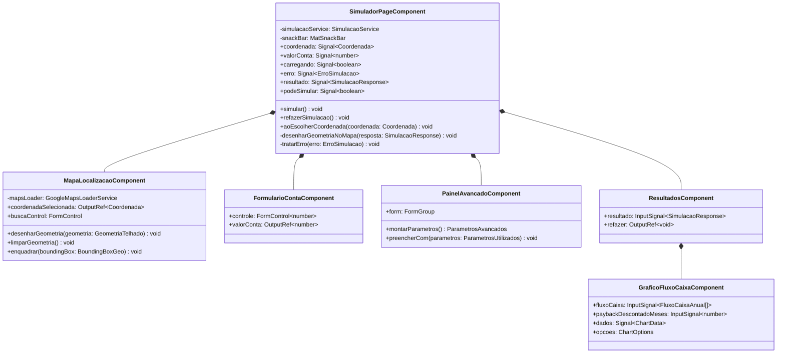
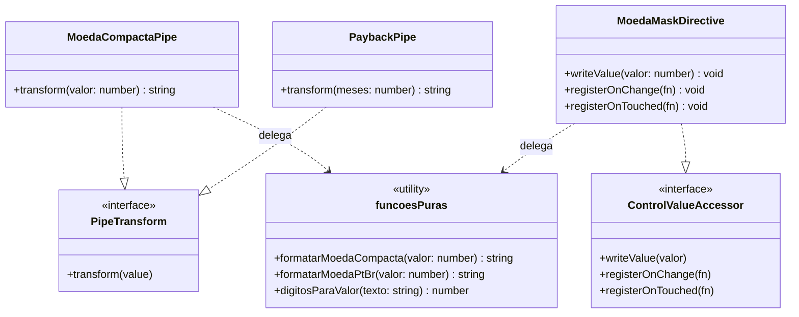

# Curazi — Documentação de Arquitetura

Este documento descreve a arquitetura do frontend do Curazi. Para instalação,
execução e deploy, consulte o [README.md](README.md); para o contrato REST,
[docs/contrato-api.md](docs/contrato-api.md).

## Visão geral

O sistema é uma **SPA (Single-Page Application)** Angular de página única, sem estado
persistido: cada simulação é uma requisição *stateless* ao backend, que concentra toda
a regra de negócio e o acesso à Google Solar API. O frontend é responsável por captura
de entrada (localização no mapa + dados da conta), apresentação dos resultados e
tradução de erros para mensagens ao usuário.

Principais conceitos de arquitetura de software aplicados:

- **Arquitetura em camadas** — o código em `src/app/` é dividido em `core/`
  (infraestrutura: acesso à API e carregamento do Google Maps), `features/`
  (componentes de tela do simulador) e `shared/` (pipes e diretivas reutilizáveis).
  Dependências fluem de `features` para `core` e `shared`, nunca no sentido inverso;
- **Container/Presentational** — `SimuladorPageComponent` é o único componente
  *container* (conhece serviços e detém o estado); os demais são *presentational*,
  comunicando-se apenas por `input()`/`output()`;
- **Fluxo de dados unidirecional com signals** — o estado da página vive em signals
  nativos do Angular (`coordenada`, `valorConta`, `carregando`, `erro`, `resultado`)
  e estados derivados usam `computed()`. Não há store global (sem NgRx);
- **Design by contract** — as interfaces em `core/api/simulacao.models.ts` são fiéis
  ao contrato REST versionado em `docs/contrato-api.md`; nenhum campo é inventado;
- **Componentes standalone com lazy loading** — a rota raiz carrega a página do
  simulador sob demanda (`loadComponent`), mantendo o bundle inicial mínimo;
- **Injeção de dependência** — serviços singleton (`providedIn: 'root'`) obtidos via
  `inject()`, com `ChangeDetectionStrategy.OnPush` em todos os componentes.

## Diagrama de fluxo do sistema

A chave da Solar API existe apenas no backend; o frontend usa somente a chave de
navegador do Maps (pública, restrita por referrer).

## Diagrama de sequência — fluxo principal (simulação)

## Camadas

### Camada `core` — infraestrutura e acesso a dados

Concentra a comunicação com o mundo externo: o backend (HTTP) e a biblioteca do
Google Maps. Nenhum componente visual vive aqui.

**Padrões de projeto:**

- **Singleton** — ambos os serviços usam `providedIn: 'root'`: uma instância por aplicação;
- **Gateway / Service Layer** — `SimulacaoService` é o único ponto de acesso HTTP ao
  backend; a URL vem de `environment.apiBaseUrl`, nunca hardcoded;
- **Adapter (tradução de erros)** — `traduzirErro()` converte `HttpErrorResponse` +
  Problem Details (RFC 9457) em `ErroSimulacao`, um erro de domínio já com mensagem
  pt-BR pronta para exibição;
- **Facade + lazy initialization** — `GoogleMapsLoaderService` esconde o carregamento
  assíncrono das quatro bibliotecas do Maps atrás de `carregar()`, memoizando a
  `Promise` para carregar uma única vez. A interface `GoogleMapsApi` expõe apenas o
  subconjunto usado, permitindo fakes nos testes (**Dependency Inversion**);
- **Observer** — o resultado da simulação é exposto como `Observable` (RxJS);
- **Funções puras** — `geometria-mapa.ts` converte o bloco `geometria` do contrato
  em vértices lat/lng (projeção do painel inclinado na vista de satélite, rotação
  pelo azimute, expansão de bounding box), sem nenhuma dependência do Google Maps —
  toda a matemática é testável em isolamento.

**Interação com as outras camadas:** `SimuladorPageComponent` (features) injeta
`SimulacaoService` para executar simulações; `MapaLocalizacaoComponent` injeta
`GoogleMapsLoaderService` para obter os construtores do Maps e usa as funções de
`geometria-mapa.ts` para montar os polígonos das camadas ilustrativas. Os modelos de
`simulacao.models.ts` são os DTOs que circulam entre todas as camadas.

**Classes e tipos da camada:**

| Elemento | Função |
|---|---|
| `SimulacaoService` | Executa `POST /api/v1/simulacoes` e traduz falhas em `ErroSimulacao` |
| `ErroSimulacao` | Erro de domínio com `slug`, mensagem ao usuário e o `ProblemDetail` original |
| `GoogleMapsLoaderService` | Carrega a biblioteca do Google Maps uma única vez e sinaliza `pronto` |
| `GoogleMapsApi` | Subconjunto tipado da API do Maps usado pela aplicação (testável) |
| `SimulacaoRequest` / `SimulacaoResponse` | DTOs do contrato REST (request/response) |
| `ParametrosAvancados` / `ParametrosUtilizados` | Parâmetros opcionais enviados e valores efetivos ecoados pelo servidor |
| `FluxoCaixaAnual` | Item do fluxo de caixa (ano 0 a 25) usado pelo gráfico |
| `GeometriaTelhado` / `SegmentoTelhado` / `PainelGeometria` | Bloco `geometria` do contrato: bounding box do edifício, planos do telhado (azimute/inclinação) e painéis do sistema orçado |
| `geometria-mapa.ts` | Funções puras de geometria: metros→graus, cantos do painel projetado/rotacionado, retângulo e expansão de bounding box |
| `ProblemDetail` / `SlugErroApi` | Corpo de erro RFC 9457 e os slugs conhecidos do contrato |

### Camada `features/simulador` — componentes de tela

Uma pasta por componente (`.ts`, `.html`, `.scss`, `.spec.ts`). É a única camada com
interface visual; toda ela é carregada por lazy loading a partir da rota raiz.

**Padrões de projeto:**

- **Container/Presentational** — só `SimuladorPageComponent` conhece serviços; os
  filhos recebem dados por `input()` e emitem eventos por `output()`;
- **Mediator** — a página orquestra os filhos: coleta a coordenada do mapa e o valor
  do formulário, pede os parâmetros ao painel (`montarParametros()`), dispara a
  simulação e devolve ao painel os valores efetivos (`preencherCom()`). Também rege o
  ciclo de vida da geometria no mapa: no sucesso chama `desenharGeometria()` e
  `enquadrar()` (fitBounds no edifício, uma vez por simulação); novo clique no mapa ou
  "Refazer simulação" chama `limparGeometria()`. Respostas sem `geometria` não
  desenham nada;
- **Observer / estado reativo** — signals e `computed()` (`podeSimular` deriva de
  coordenada + valor + carregando); outputs propagam eventos filho→pai;
- **Memento (simplificado)** — a última requisição é guardada para o retry do
  snackbar em erros transitórios.

**Interação com as outras camadas:** a página injeta `SimulacaoService` (core) e
mapeia `ErroSimulacao` para a UI (banner para erros de negócio, snackbar com retry
para transitórios). O mapa consome `GoogleMapsLoaderService` (core). O formulário usa
`MoedaMaskDirective` (shared) e os resultados usam os pipes de formatação (shared).

**Classes da camada:**

| Componente | Função |
|---|---|
| `SimuladorPageComponent` | *Container*: detém o estado em signals, orquestra o fluxo e trata erros |
| `MapaLocalizacaoComponent` | Mapa satélite de Maceió com marker, busca por endereço com autocomplete, reverse geocode e as camadas ilustrativas pós-simulação (holofote com furo no edifício, planos do telhado e painéis) — polígonos `clickable: false`, estilo centralizado em `ESTILO_GEOMETRIA` |
| `FormularioContaComponent` | Campo do valor mensal da conta com máscara monetária e validação (R$ 50 a R$ 50.000) |
| `PainelAvancadoComponent` | Painel expansível de parâmetros opcionais; monta o request e ecoa os valores usados |
| `ResultadosComponent` | Grade de cards com os indicadores, disclaimers, atribuição ao Google e botão "Refazer" |
| `GraficoFluxoCaixaComponent` | Gráfico de linha (Chart.js) do fluxo de caixa acumulado nominal × descontado, com ponto de payback |

### Camada `shared` — pipes e diretivas reutilizáveis

Utilitários de apresentação sem estado, organizados em `pipes/` e `directives/`.
Não dependem de `core` nem de `features`.

**Padrões de projeto:**

- **Adapter** — `MoedaMaskDirective` implementa `ControlValueAccessor`, adaptando um
  `<input>` com máscara monetária pt-BR ao protocolo dos Reactive Forms
  (`FormControl` de `number`);
- **Strategy (via interface do framework)** — os pipes implementam `PipeTransform` e
  são plugados nos templates como estratégias de formatação;
- **Funções puras** — a lógica de formatação/parsing vive em funções exportadas
  (`formatarMoedaCompacta`, `digitosParaValor` etc.), testáveis isoladamente e
  reutilizadas fora dos templates (ex.: eixo Y do gráfico).

**Interação com as outras camadas:** `features` consome a diretiva no formulário da
conta e os pipes nos resultados; `GraficoFluxoCaixaComponent` reutiliza
`formatarMoedaCompacta` diretamente nos ticks do Chart.js. `shared` não conhece
nenhuma outra camada.

**Classes da camada:**

| Elemento | Função |
|---|---|
| `MoedaCompactaPipe` (+ `formatarMoedaCompacta`) | Formata valores em moeda compacta pt-BR (ex.: "R$ 15 mil") |
| `PaybackPipe` | Converte meses em texto "X anos e Y meses" |
| `MoedaMaskDirective` (+ `formatarMoedaPtBr`, `digitosParaValor`) | Máscara monetária pt-BR como `ControlValueAccessor` para Reactive Forms |

### Bootstrap da aplicação (`app.*`)

Camada mínima de composição: `App` (componente raiz, só um `<router-outlet />`),
`app.config.ts` (providers globais: router, `HttpClient` com fetch, animações,
locale/moeda pt-BR e fonte de ícones Material Symbols) e `app.routes.ts` (rota única
com `loadComponent` lazy para `SimuladorPageComponent`). O diretório `testing/`
contém apenas o mock compartilhado da resposta de simulação usado nos specs.
